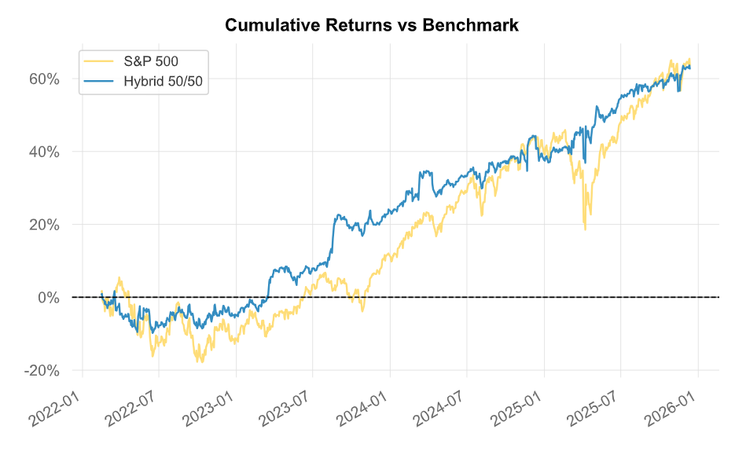

# XGBoost Analytics Pipeline for Post-Earnings Drift Detection using Walk-Forward Optimization 📈

This project implements a data engineering and machine learning pipeline designed to detect post-earnings price anomalies by integrating free multi-source financial data. It uses an XGBoost regressor optimized via Optuna within a rigorous walk-forward framework to prevent data leakage and ensure realistic backtesting performance.

## Why this project exists
This project focuses on three core challenges in financial machine learning
1. ### **Data Integrity & Alignment**
- **Point-in-Time**: Features are strictly aligned to the first market opening session following an earnings release. Regardless of the publication timestamp (e.g., pre-market at 6:00 AM or post-market on a Friday at 5:00 PM), data is shifted to "Day t" to ensure that signals are generated only when the information is publicly available
- **Cross-Source Data Integration**: Integrated fundamental data from SimFin (2021–2024) and yFinance (2025–2026), resolving discrepancies in labeling and naming conventions for financial statement line items to ensure consistent data across the entire timeline, regardless of the original source.
2. ### **Methodological Rigor**
- **Out-of-Sample Hyperparameter Optimization** - To prevent look-ahead bias via hyperparameter selection, I applied a walk-forward validation framework with out-of-sample hyperparameter selection. Optuna optimization was performed on period $X$, but the resulting best parameters were applied strictly to the subsequent period $X+1$.
XGBoost training was performed on period $X$ and tested in the subsequent period $X+1$.
- **Non-Overlapping Validation Gap during Optimization** - Implemented a 10-day training gap between the training and test sets to account for the target's look-ahead window, preventing the model from leaking future return information into the learning process.
- **Feature Selection & Multicollinearity Reduction**: Performed rigorous feature selection to prune the initial high-dimensional dataset, removing redundant and correlated predictors that shared overlapping information. This selection improved the model's performance by reducing noise and ensuring that different features provide unique information rather than repeating the same signals.
3. ### **Realistic Simulation**
- **Sequential Portfolio Simulation**: Applied a system that uses a daily loop to track active positions. It realistically manages capital by checking exit dates and only reinvesting funds when positions are closed, ensuring the performance reflects a real-time account balance.
- **Capital Constraints & Exposure Limits**: The simulation enforces a strict 100% maximum exposure limit. New signals are only executed if there is available capital; otherwise, they are skipped. This prevents unrealistic leverage and accounts for the physical limits of the portfolio
- **Liquidity Filtering**: The model excludes "penny stocks" by requiring a minimum price of $20. This ensures the simulation avoids low-liquidity and hard-to-borrow assets with unrealistic spreads.


## Data Sources & Technologies

1. ### Data Sources
- **Fundamental Data**: Sourced from **SimFin** (historical) and **yFinance** (historical and current).
- **Market Data**: Daily price action and volume via yFinance API.
- **Market Context**: Integration of **SPY** (S&P 500 ETF) as a benchmark and **VIX** (Volatility Index) as a market sentiment proxy.
- **Scalable Data Ingestion**: Designed to handle large historical datasets and seamlessly integrate new annual updates.

2. ### Tech Stack
- **Persistence**: **SQLite** managed via SQLAlchemy for structured storage and efficient data retrieval.
- **Processing & Analytics**: **Pandas** and **NumPy** for feature engineering; **SciPy** for statistical normalization.
- **Machine Learning**: **XGBoost** (XGBRegressor) for predictive modeling, optimized with **Optuna** for Bayesian hyperparameter tuning.
- **Evaluation**: **Scikit-learn** for validation metrics and **Matplotlib**, **Quantstats** for performance visualization.

## Pipeline Overview ##
The system is designed as a modular, end-to-end analytical pipeline, moving from automated data ingestion to robust out-of-sample signal evaluation under realistic assumptions.

1. ### **Data Ingestion & Stabilization**
- **Multi-Source ETL**: Automated retrieval of fundamental data (SimFin / yFinance), market prices, and earnings calendars for the US equity market.
- **Integrity Filters**: Instruments are restricted to common stocks (excluding warrants and units), and financial reports with more than 40% missing values are removed at the source.
- **SQL**: All raw and intermediate datasets are stored in SQLite, ensuring reproducibility and enabling updates.
2. ### **Point-in-Time Alignment**
- **Publication Alignment**: Reports released after 4:00 PM (market close) are shifted to the next trading day to eliminate look-ahead bias. Non-trading days are mapped to the nearest valid session.
- **Point-in-Time Synchronization**: Financial statement data is aligned with actual market availability using merge_asof.
3. ### **Feature Engineering & Cross-Sectional Normalization**
- **Fundamental Dynamics**: QoQ growth rates, profitability metrics, and capital structure ratios are designed to handle missing values and zero-division.
- **Cross-Sectional Z-Scores**: A rolling 90-day sector-based normalization compares each company against its peers, enabling detection of relative outliers within industries.
- **Market Context Features**: Integration of volatility (EWM), volume anomalies, and normalized market sentiment (VIX Z-score) to capture changing market regimes.
4. ### **Machine Learning Framework**
- **Walk-Forward Validation**: Models are trained on historical data (Period $X$) and evaluated on strictly unseen future data (Period $X$+1).
- **Hyperparameter Optimization**: Optuna (TPE sampler) is used to optimize model hyperparameters and decision thresholds.
- **Leakage Control**: A 10-day gap is enforced between training and validation sets, matching the prediction horizon and preventing overlap.
5. ### **Signal Evaluation & Benchmarking**
- **Directional Assumption**: The model is designed to identify negative return signals, meaning it focuses exclusively on downside prediction. As a result, signals are implemented in a short-exposure framework, which makes the model naturally suited for portfolio hedging and diversification purposes rather than directional market participation.
- **Execution Assumption**: To ensure market realism, the final strategy assumes entry at the next-day closing price (T+1). This  conservative constraint accounts for potential slippage and liquidity issues, prioritizing backtest integrity over paper profits.
- **Sequential Capital Simulation**: A daily loop tracks active signals and enforces a maximum exposure constraint, ensuring realistic capital allocation dynamics.
- **Performance Evaluation**: Results are analyzed using risk-adjusted metrics and compared against the SPY benchmark, including Sharpe Ratio, Calmar Ratio, and alpha attribution.

## Validation methodology ##

- ### **Walk-Forward / Expanding Window**
The model uses an expanding training window (e.g., 2021–2022, 2021–2023, 2021–2024), where the training set grows cumulatively to capture more historical data while the model is tested on the unseen year (Out-of-Sample). This iterative process ensures the system adapts to evolving market regimes by learning from an increasing pool of data while maintaining a separation between past observations and future predictions.
- ### **TimeSeriesSplit with gap**
Implemented a 10-day training gap between the training and test sets during the hyperparameter optimization with Optuna, to account for the target's look-ahead window, preventing the model from leaking future return information into the learning process.
- ### **walk-forward + out-of-sample hyperparameter transfer**
To eliminate the risk of hyperparameter overfit, the system uses a walk-forward validation framework with out-of-sample hyperparameter selection. The hyperparameters optimization process (Optuna) is conducted entirely on period $X$. These optimized settings are then carried forward and applied to the model during the test phase of period $X+1$. Similarly, the XGBoost regressor is trained on data from period $X$ and evaluated exclusively on the following period $X+1$, maintaining a strict chronological separation between the learning and testing phases.

## Feature Engineering

To ensure the model captures both absolute financial health and relative market dynamics, I developed a multi-layered feature engineering pipeline focused on numerical stability and sector-based comparison.

## Data Stability

**Custom Numerical Safeguards**: Implemented handling for financial data anomalies via safe_ratio, safe_log, and signed_log transformations. These functions normalize high-variance distributions and maintain the mathematical integrity of negative values, while preventing pipeline crashes due to division-by-zero or NaN errors.

## **Fundamental Feature Groups**

1. ### Core Financial Ratios (17 Indicators)
A comprehensive set of 17 standard financial metrics derived from Balance Sheets and Income Statements, covering profitability, debt structure, operational efficiency, and liquidity. These include key measures of solvency, asset turnover, and per-share market values.

2. ### Growth Dynamics & Size Scaling
 Assets and revenues are log-transformed to normalize the scale variance across companies of different market capitalizations. The pipeline calculates quarter-over-quarter (QoQ) deltas for all primary financial items to capture momentum in business performance.

 3. ### Earnings Quality and Fundamental Momentum
 Earnings Per Share (EPS) QoQ dynamics are calculated using a symmetric Mean Absolute Percentage Error (sMAPE) logic. Integration of "reported vs. estimated" EPS data (EPS Surprise) to capture market deviations from analyst consensus. For all 17 core ratios, the pipeline calculates Log-Delta QoQ changes using the signed_log approach.

 4. ### Sector-Relative Analysis
To eliminate industry bias, every fundamental feature is standardized into a Z-score relative to its sector peers. By using rolling 90-day sector statistics, the model identifies outliers within a specific industry context

## **Market Feature Groups**
1. ### Lagged Returns
 The model implements 1-day lagged log returns and overnight returns to capture immediate price momentum and sentiment shifts between market sessions. These features are shifted by $T-1$ to ensure the model relies strictly on available historical data at the time of prediction.

 2. ### Momentum and Volatility
 Price momentum is tracked across monthly, quarterly, and semi-annual horizons using standardized log returns (Z-scores).
 Historical volatility is calculated using EWM (Exponentially Weighted Moving Average) over 5, 10, and 20-day windows.

 3. ### Global Risk Sentiment (VIX)
  The CBOE Volatility Index (VIX) is integrated via log-transformations and 60-day rolling Z-scores. This captures broader market fear levels and systemic risk.

## Feature Selection & Dimensionality Reduction
The final model underwent a rigorous feature pruning process to reduce dimensionality and mitigate multicollinearity. Many initial features conveyed overlapping market information, which introduced significant noise and risked model overfitting. By eliminating redundant indicators, the model shifted its learning focus toward non-correlated signals, which contributed to improved model stability and performance. The final version of the model is using 27 out of the 68 initial features that were created. Balance between fundamental and market-derived features allows the model to capture both company-specific signals and broader market conditions.


### Performance Analysis & Key Insights
The strategy’s performance was evaluated using the quantstats library, focusing on the model's ability to act as a diversification engine for a standard equity portfolio. Full interactive HTML reports for various configurations are available in the /results directory.

### The Diversification Edge: 50/50 Hybrid Portfolio
One of the key findings of this analysis is the impact of combining the model with a long-only benchmark (SPY). By allocating 50% to the optimized model and 50% to the SPY index, the portfolio achieved superior risk-adjusted stability compared to a 100% SPY holding.

| Metric | SPY (Benchmark) | 50/50 Hybrid Portfolio |
| :--- | :---: | :---: |
| **Sharpe Ratio** | 0.81 | **1.08** |
| **Annual Volatility** | 18.0% | **12.5%** |
| **CAGR** | 13.79% | **13.62%** |

### Strategy Performance Visualization



### **Key Insight**
 The hybrid approach successfully reduced exposure to systematic market risk, significantly lowering volatility and smoothing the equity curve without sacrificing long-term growth.

### **Available Reports (/results)**
For a detailed breakdown of the model's performance under different execution and sector constraints, refer to the following reports:

1. **Execution Timing Analysis**: Comparing Close T+1 vs. Open T to quantify the impact of execution slippage and timing.

2. **Sector Sensitivity**: Performance delta between the Full Universe and the Ex-Healthcare model to identify sector-specific alpha persistence.

3. **Benchmark Comparison**: Direct performance of the strategy against the SPY index.

4. **Portfolio Integration**: Detailed metrics of the 50/50 Hybrid Strategy showcasing the reduction in tail risk.

### 8. Limitations & Risk Disclosures
To maintain transparency, it is essential to acknowledge the limitations of the current backtesting framework and data environment.

### **Data Quality & "Restated" Values**
Fundamental data from financial providers can be subject to quality constraints. Specifically, providers may supply "restated" values (corrected after the original filing), which can introduce a subtle look-ahead bias if not perfectly aligned with the original point-in-time release.

### **Historical Validation**
The results presented are strictly based on historical backtesting. Past performance is not a guarantee of future results, and transitioning this model to live trading would require an independent verification phase to account for real-time API latencies and data stability.

### **Simplified Execution Assumptions**
The model assumes execution at Close T+1 or Open T. While this provides a conservative baseline, real-market execution involves complexities such as slippage, variable borrow costs for short-selling, and liquidity constraints that are simplified within this simulation.

### **Regime Sensitivity**
The model was trained and tested over specific market cycles. Its performance may vary significantly under unprecedented macroeconomic regimes that differ fundamentally from the historical training distribution.

## **Installation and Usage**

> **Note**: The current configuration reflects the optimal model version (**Close T+1 full**). To evaluate different strategy variants, the model horizon parameters must be adjusted manually in the source code.
- **Prerequisites**
* Python 3.8 or higher
* Git

### Setup
1. **Clone the repository:**
```bash
git clone https://github.com/adamskiba5115/XGBoost-Analytics-Pipeline-for-Post-Earnings-Drift-Detection.git
cd XGBoost-Analytics-Pipeline-for-Post-Earnings-Drift-Detection
```

2. **Create and activate a virtual environment**
```bash
# Windows
python -m venv venv
venv\Scripts\activate

# macOS/Linux
python3 -m venv venv
source venv/bin/activate
```

3. **Install required dependencies**
```bash
pip install -r requirements.txt
```

### Execution
> **Note**: Re-running the hyperparameter optimization is not required for the (**Close T+1 full version**). The model automatically loads the best-performing parameters from src/optimized_params.json.
```bash
python run_pipeline.py
```

### Output

* **Logs**: Terminal output tracks real-time progress across all pipeline stages.
* **Parameters**: The model utilizes pre-calculated optimal hyperparameters stored in src/optimized_params.json.

## Project Structure

- `run_pipeline.py` — Main entry point to execute the full analytical pipeline.
- `config.py` — Centralized configuration (paths, database settings, constants).
- `src/` — Core logic of the application:
  - `data_ingestion.py` — Automated data retrieval and cleaning.
  - `feature_engineering.py` — Technical indicators and signal generation.
  - `optimization.py` — Hyperparameter tuning using Optuna.
  - `model.py` — XGBoost model training and prediction logic.
  - `backtest.py` — Strategy performance evaluation.
  - `optimized_params.json` — Pre-calculated optimal hyperparameters.
- `results/` — Output folder for performance reports and visualizations.
- `requirements.txt` — List of necessary Python libraries.

## Future Work & Research Directions
This project serves as a foundational framework for systematic equity signal research. Future iterations will focus on increasing the system's robustness and moving toward a production-ready environment:

1. **Automated Data Pipeline**
Transitioning from manual updates to an automated ETL pipeline.

2. **Regime-Specific Parameter Versioning**
Implementing dynamic hyperparameter sets tailored to different market regimes to improve model adaptability.

3. **Advanced Execution Modeling**
Refining the backtest engine to include more granular slippage models, variable borrow costs, and liquidity-weighted simulations.

4. **Live Data Feed Integration**
Connecting the pipeline to a real-time data provider (e.g., Interactive Brokers or Alpaca API) to enable real-time performance monitoring.
